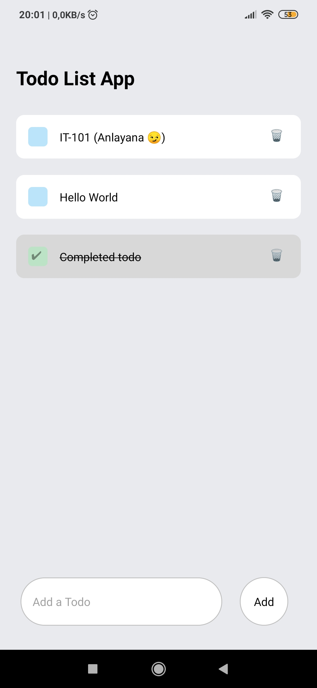

# react-native-todo-list



## Description

`react-native-todo-list` is a basic mobile application that i built for learning `react-native`.

## Resources

- [React Native docs](https://reactnative.dev/docs/getting-started)
- [Expo docs](https://docs.expo.io/)
- [TypeScript docs](https://www.typescriptlang.org/docs/)

## Development

**1. Clone repository**

```bash
git clone https://github.com/yasinosman/react-native-todo-list.git
```

**2. Install dependencies**

```bash
npm install
```

**3. Start development server**

```bash
npm start
```

**Note:** You can use `expo` developer tools or `Expo Go` mobile application to see the todo list in mobile devices

## Contribution

Feel free to use issues & pull requests to ask for changes.
